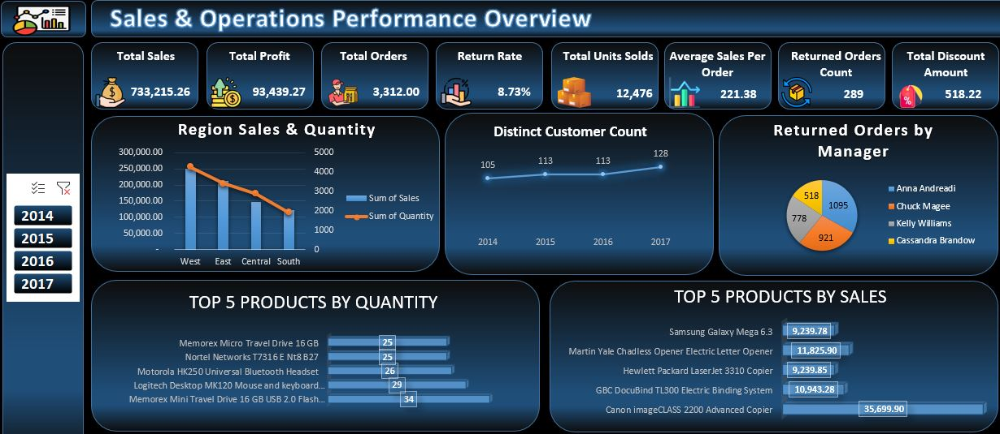

#  Sales & Operations Performance Overview

## 1. Overview
This project provides a comprehensive data analysis of a business's sales and operational performance. The analysis was conducted using Microsoft Excel's Power Pivot data model to create an interactive dashboard that visualizes key metrics and trends. The dashboard allows for filtering by year, providing dynamic insights into the company's performance.

## 2. Data Sources
The analysis is based on a data model created by establishing relationships between the following three datasets:

* Orders: This is the main transactional table containing detailed information on each sale.

* Managers: A lookup table that links each sales manager to their corresponding region.

* Returns: A table that tracks all returned items, which is linked to the Orders table to calculate returns-related metrics.

## 3. Data Model Measures (KPIs)
The Power Pivot data model includes the following calculated measures (Key Performance Indicators) to summarize and analyze the data:

* Total Sales: `SUM(Orders[Sales])`

* Total Profit: `SUM(Orders[Profit])`

* Total Orders: `COUNTROWS(Orders)`

* Total Units Sold: `SUM(Orders[Quantity])`

* Average Sales Per Order: `AVERAGE(Orders[Sales])`

* Return Rate (%): `DIVIDE([Returned Orders Count], COUNTROWS(Orders))`

* Returned Orders Count: `CALCULATE(COUNTROWS(Orders), Orders[Returned] = "Yes")`

* Total Discount Amount: `SUM(Orders[Discount])`

## 4. Visualizations
The dashboard presents the data through several key visualizations, including:

* Region Sales & Quantity (Bar and Line Chart)

* Distinct Customer Count (Line Chart)

* Returned Orders by Manager (Pie Chart)

* Top 5 Products by Quantity (Bar Chart)

* Top 5 Products by Sales (Bar Chart)

## 5. Report
A formal report, titled "Data Analysis Report for the Year 2017," is also included with this project. It provides a detailed, narrative summary of the key findings, insights, and recommendations derived from the dashboard's data for the specific year 2017.

## 6. ScreenShots
### DashBoard

